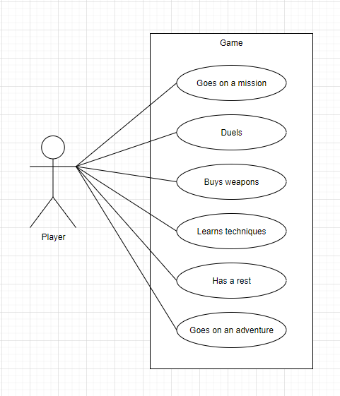
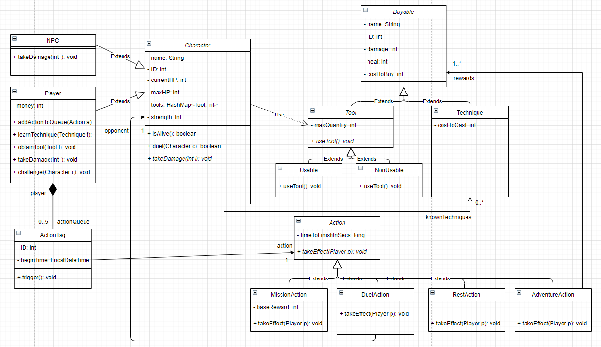

# AdventureGame
## 1. Üzleti igények
### Szöveges leírás
A projekt célja egy játék elkészítése. Regisztrációt követően egy saját karaktert kapunk, amit belépés után elérhetünk. A karakterünket jellemzi az életerereje és a manája. Ha az életerő bármely okból elfogy, megadott hosszúságú pihenőre vonul a karakter, ez alatt semmiféle akciót nem végezhet. A mana technikák használatára fordul, ha elfogy, nem tudjuk ezeket használni. Pihenéssel az életerő és a mana is növelhető.

A játékos pénzt fordíthat új eszközök vagy technikák vásárlására, ezektől erősebb lesz, és nagyobb eséllyel jár sikerrel, ha párbajozik vagy kalandban vesz részt, illetve nagyobb jutalmat kap küldetések teljesítésekor.

Lehetőségünk van más játékosokat vagy NPC-ket párbajra hívni. Kalandozások során ritka fegyverekre vagy technikákra tehetünk szert, de nagyobb a rizikó is. A párbajok, küldetések, kalandok teljesítése, illetve a pihenés megadott mennyiségű időt igényel, amíg ez nem telik le, mást nem csinálhatunk.

Az eszközöknek két fajtája van, vannak a használható és nem-használható eszközök. Ha használható eszközt veszünk igénybe párbaj során, az "elveszik", vagyis eltűnik az eszköztárunkból. A nem-használható eszközök megmaradnak használat után is. Az eszközöket és a technikákat jellemzi az erősségük, ami számításba lesz véve az akciók során. Az eszközök maximális mennyisége megadja, egy adott típusból hány darab növeli az effektív erejét a karakterünknek.

Öt darab cselekvést tudunk sorba állítani egyszerre, ekkor az eltárolt cselekvések sorban kerülnek elvégzésre, kivéve, ha közben elfogy az életerő, ekkor kényszerű pihenésre vonul a játékos.

### Követelmény lista

| ID  | Prioritás    | Megjegyzés                                  |
| ----|--------------|-------                                      |
| 1   | magas        | A felhasználónak lehetősége van regisztrálni, regisztráció után pedig   jelszavas autentikációval belépni |
| 2   | magas        | Vannak fegyverek, amiket pénzért cserébe megszerezhet a játékos  |
| 3   | magas        | Vannak technikák, amiket pénzért cserébe megtanulhat a játékos   |
| 4   | magas        | Lehetőség van párbajozni más játékosokkal vagy NPC-kkel          |
| 5   | magas        | Ha elfogy az életerőnk, megadott ideig nem végezhetünk semmiféle cselekvést |
| 6   | közepes      | Kalandokkal ritka fegyverekre vagy technikákra tehetünk szert    |
| 7   | magas        | Küldetésekkel az erőnkkel arányos mennyiségű pénzt szerezhetünk  |
| 8   | magas        | Amíg egy elvállalt cselekvéssel nem végeztünk, mást nem csinálhatunk  |
| 9   | alacsony     | Eszközök maximum mennyiségének figyelembe vétele erő számításakor|
| 10  | alacsony     | Párbajok részletes leírása                                       |
| 11  | közepes      | Öt cselekvés sorba állítható, de ha elfogy az életerő, törlődik a sor és pihenés következik |

## 2. Terv
### Use-case diagram

### Class diagram

### Szekvencia diagram

TODO

### ER diagram

TODO